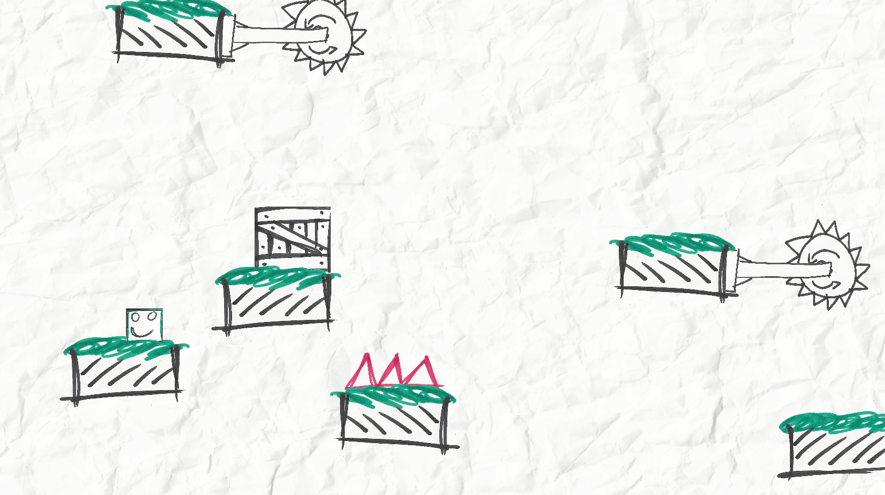
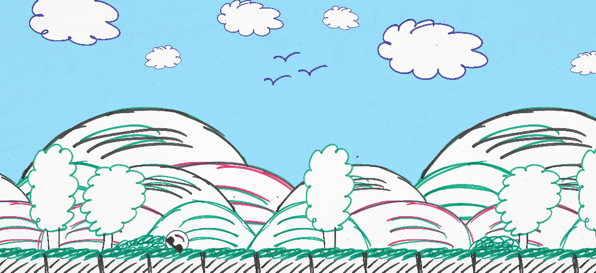
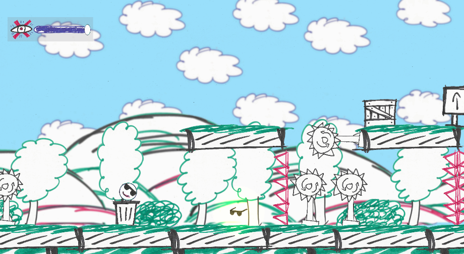

b# game-jam2
A puzzle physics platformer game made in a week for the [Brackeys Game Jam 2022.1](https://itch.io/jam/brackeys-7). The goal is to have a semi finished prototype which include the following: 
* game design which fits the theme
* better graphics, music and sfx then last time
* more polish then last time

## Dev Screenshots
* first screenshot 
    * 
* second screenshot 
    * 
* third screenshot 
    * 

  
  

## To Do List
? = not sure if enough time or if it should be implemented
crossed out text = done
|| = partly done (count lines etc)
### General
* find a name for the game -> Red Eye, Invisible Door, Find the Door, Rolling Glasses
* get your game play tested by 5 people or more ? too late for that

### Most important for today *(23.2)*
* ~~test the game design of the xray view -> works good~~
    * ~~test change xray time to just work when player holds button down, and he has like 3 seconds to use after its depleted it take 3 seconds to recharge, but only when fully recharged its usable (grey while recharging)~~
        * ~~-> added 5 sec viewable timer to platforms, they slowly fade out~~
        * ~~-> xray can just be refiled with pickups'~~
* ~~draw "ball player"~~
* ~~and just 1 health, because it makes everything worse~~ → instant death makes it better
* ~~add parallax effect to game so it has depth -> added it but need to change art for the "infinity" layers~~

### Most important for today *(26.2)*
* ~~"level done" pickup w/ icon and  next lvl canvas(without function)~~
* add some pickup for points/ u have to pick up all to pass a level... ?
* ~~create a moving platform script with a lot of public settings, which can be used for everything (platforms, spikes, saws) -> use debug line to show their travel range,speed etc~~
* level loading mechanism & menus etc ?
    ### SFX (1,5h) -> took 2,5h
    should also be done before starting level creation. I very simple in unity.
    * ~~player "rolling/walking", jumping, landing, getting hit, dying~~
    * ~~canon shooting, bullet hitting~~
    * ~~chainsaw working~~
    * ~~pushing boxes~~
    * ~~using xray effect~~
    ### Level Design & play testing (5h)
    Levels design and creation of the 3 levels should be done after all the art and game mechanics are almost final. 

    * tutorial level |
        * text tutorial while clicking next etc 
    * first easy level ||
    * second/end level
    * checkpoints ?
    * 5 min playtime for the whole game ?  
___
### Art 
- ~~import all art without cutting the corners to hard~~
    - ~~import new art~~
    - ~~reimport old assets~~
- ~~different backgrounds (tree layer, mountains/hills etc)~~
 - ~~draw hearts for UI~~
- ~~draw icon/bar for xray view~~
- ~~blur background images in gimp -> doing that in unity is too much work (setting up different camera for postprocessing etc)~~
- ~~make the 3 backgrounds in gimp~~
    #### *later*
    * particle effects for everything (getting hit, landing somewhere)
    * post processing ?
    * ~~light at pickups ?~~
    * shader w/ radius for x ray ?
### UI (1h)
* ~~show xray view somehow~~
* next level/level completed canvas
* death counter ?
* starting menu etc
* ~~drawing it all & scanning~~
-> maybe skip the level loader etc, just one big level....

### Music (1h)
* some music which matches the style and pace of the game
* 1 songs minimum, which loop

___
  
## Things learned (misc list)
* time management and splitting the work for each day is critical
* a week long game jam is too long to have a real "sprint"
* always import all sprites with the same pixels per unit, so they look good with a scale of one. This makes it easier for scaling and all sprites look the same/better..
* art is never finished and can always be improved upon
* the structure of the imported art runs threw the Sprite & prefabs folder structure
    * a good folder structure for the art should be chosen at the beginning of the project
* the level hierarchy should always group similar objects together so it does not become a mess (should also match the art folder structure)

* Unity Stuff
    * a second collider type can be added to a trigger collider. Then it can still interact with collision etc
    * when starting to design a level, move everything below the UI/Canvas elements. They wont intervene with "taller" level and selecting objects in the scene view

___
  
## To do after jam
* commenting & adding a description to all the scripts
    * organize the scripts into folders
    * rename scripts if needed

